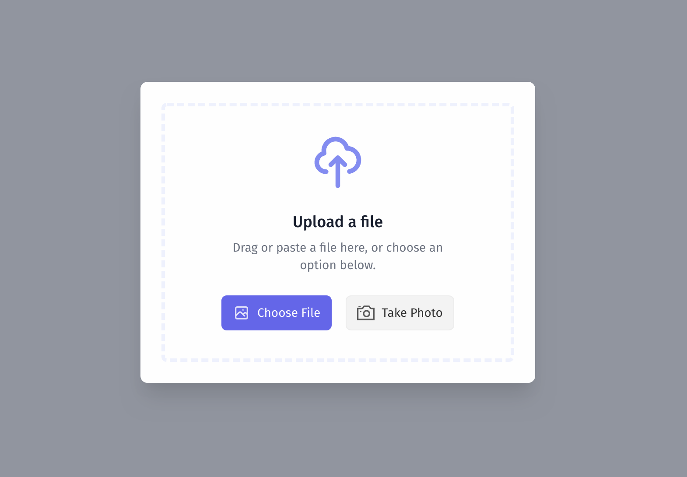

# quikpik

A file picker for evergreen browsers.

- Drag and drop a file
- Paste a file
- Browse and select a file
- Capture an image from your camera
- Adjust images via crop and rotate



## Installation

Via NPM:

```
npm install quikpik
```

Or use unpkg:

```
<script src="https://unpkg.com/quikpik@0.0.20/dist/quikpik.js"></script>
<link rel="stylesheet" href="https://unpkg.com/quikpik@0.0.20/dist/quikpik.css"></script>
```

## Usage

Quikpik doesn't implement the upload for you, so the uploader is the one argument you must pass in. The following example shows how to upload a file to S3 using quikpik and [XMLHttpRequest](https://developer.mozilla.org/en-US/docs/Web/API/XMLHttpRequest). Here, `presigned` is an object that contains S3 presigned post data.

```js
// Result is either undefined (if the user cancels the picker)
// or it is the value returned from your upload function.
const result = await quikpik({
  upload({ file, onProgress }) {
    const xhr = new XMLHttpRequest();
    const data = new FormData();

    data.append('Content-Type', file.type);
    data.append('key', presigned.fullKey);
    data.append('AWSAccessKeyId', presigned.awsAccessKeyId);
    data.append('acl', presigned.acl);
    data.append('policy', presigned.policy);
    data.append('signature', presigned.signature);
    data.append('file', file);

    const promise = new Promise((resolve, reject) => {
      xhr.onreadystatechange = () => {
        if (xhr.readyState === 4) {
          if (xhr.status >= 200 && xhr.status < 300) {
            resolve(xhr);
          } else {
            reject(xhr);
          }
        }
      };
      
      xhr.upload.addEventListener('progress', (e) => {
        onProgress(Math.ceil((e.loaded / e.total) * 100));
      });

      xhr.open('POST', presigned.url);
      xhr.send(data);
    });

    return {
      promise,

      cancel() {
        xhr.abort();
      },
    };
  },
});
```


## Status

This is really early days for quikpik. I have yet to ad localization parameters, tests, etc. It's very much a work in progress.

## Credits

If you like the quikpik UI, you'll love (tailwindui)[https://tailwindui.com/] on which it's based. I'm not afilliated. I'm just a subscriber and a fan.
